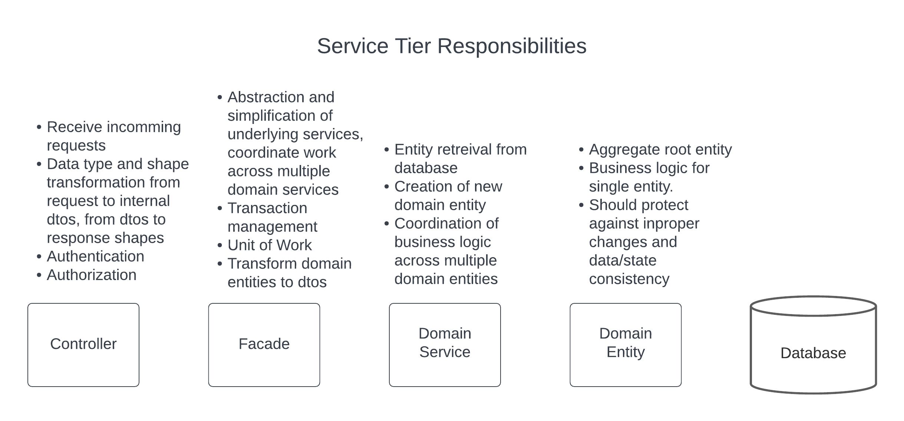

# Features

This template has been created to demonstrate sample implementation of key features of an expected microservice oriented api.  The template is based around a shopping cart or order, that gets pricing information for another catalog api serivce. The actual domain functionality is implemented only to the point of being able to illusatrate concepts.

## Feature Overview

Here is a high level list of things to note, for more details see below.

* .net core api
* IdentityServer/OpenID Connect authentication
* Permission based authorization with PolicyServer
* Health checks
  * /health endpoint
  * background health service
  * custom check
* AMQP message publication
  * using outbox pattern for resilience
* AMQP message consumption
* OpenAPI
  * [Swagger](http://localhost:5000/swagger/index.html)
  * [ReDoc](http://localhost:5000/api-docs/v1/index.html)
* [MiniProfiler](https://github.com/MiniProfiler/dotnet)
  * [http://localhost:5000/profiler/results-index](http://localhost:5000/profiler/results-index)
* Logging
* ApplicationInsights

## Other

* Distributed locks using [DistributedLock](https://github.com/madelson/DistributedLock)
    * Distributed locks can be help in coordinating work between multiple instances of a service or potentially across services.  The [OrderStateChangedHandler](src/Acme.ShoppingCart.DomainEvent/OrderStateChangedHandler.cs) creates a lock based on the orderResourceId to ensure that multiple messages are not interacting with the same resource at the same time.  The The nuget package provides differing lock providers based on case, i.e. the service may use the database or redis instance that would be common to all of the instances of the service running.  The integration tests use file provider to make it easer for tests to be run in a build environment with minimal dependencies.
* Timed background service
    * It is not uncommon to have periodic actions take place.  These can be handled in one of two ways, either through an external cron process that publishes an amqp message to "do the work" or by a background process in the service.  [ExampleHostedService](src/Acme.ShoppingCart.Hosting/ExampleHostedService.cs) is an example that implements a background process.  This example doesn't do anything other than log that it's doing something, but data cleanup or delayed processing could happen here.  It might be a good ideal to make use of a distributed lock to make sure that multiple instances aren't doing the same work at the same time.
* Concrete model mapping
    * [AutoMapper](https://github.com/AutoMapper/AutoMapper) can be a decent choice for smaller projects but has limitations in debugging and class/member reference tracking in code.  The mappings in this project were created by hand in conjuction with the free version of a visual studio [plugin](https://mappinggenerator.net/) to enable faster creation.  For an article that talks about issues with AutoMapper, see it [here](https://cezarypiatek.github.io/post/why-i-dont-use-automapper/).  It's also worthwhile to read the author's intended [usage guidelines](https://jimmybogard.com/automapper-usage-guidelines/).
* Api specific exposed models
    * So that the exact exposure of the api can be deliberately controlled and can differ from underlying implementation, specific request and response models exist in the WebApi project to expose.  Use of the mappers above should easy the coercion from one type to another in an explicit way for api consumers.  
* Facades
    * This is a layer of the service that provides an abstraction to simplify the interactions that can take place with domain services.  This is also that layer that should be defining the start and stop of a unit of work as well as any transactional isolation level needs.  See [OrderFacade](src/Acme.ShoppingCart.Facade/OrderFacade.cs) for an example of coordinating work between multiple domain services will retaining control of the unit of work.  See [CustomerFacade](src/Acme.ShoppingCart.Facade/CustomerFacade.cs) for an example of setting the isolation level for a unit of work while performing a search.  This layer should be responsible for translating from entities to dtos.
* UnitOfWork
    * started when injected
    * used to control the scope of the over all transaction.  it's implied by single calls to it's SaveChangesAsync method
    * can be used to begin an explicit transaction or strategy
* copy of files
    * don't specify copy always unless really needed, it adds additional build time with dependencies
* entity class as domain logic class
    * DDD style domain entities, where domain classes are responsible for their consistency of their own state.
* bowdlerizer
    * When logging objects, some properties may be [obfuscated](https://github.com/cortside/serilog.bowdlerizer) so that sensitive information is not visible.  [OrderStateChangedHanlder](src/Acme.ShoppingCart.DomainEvent.OrderStateChangedHandler.cs) log an order object, to keep customer name out of logs [appsettings.json](src/Acme.ShoppingCart.WebApi/appsettings.json) has rules in `Bowdlerizer` section for obfuscating specific properties.
* integration tests with testserver

## Feature Overview

You can find documentation that points out the expectations or needs of a microservices and related architectural documentation [here](https://github.com/cortside/guidelines/tree/master/docs/architecture).

### Synchronous communication

[Synchronous communication](https://github.com/cortside/guidelines/blob/master/docs/architecture/Microservices.md#synchronous-communication) between services is handled by use of HTTP requests and responses responses.  The CatalogClient is an implementation of this, making use of a [RestSharp](https://github.com/restsharp/RestSharp) based [base client](https://github.com/cortside/cortside.restsharpclient) that itself handles authentication, logging of operations, correlation, serialization, caching, and error handling.

### Asynchronous messaging

[Asynchronous messaging](https://github.com/cortside/guidelines/blob/master/docs/architecture/Microservices.md#asynchronous-messaging) is used to communicate changes and events between services by use of AMQP messages.

Each service will subscribe to the message types that it's interested in.  [`RecieverHostedService`](https://github.com/cortside/cortside.domainevent), which uses `DomainEventReceiver`, handles listening for any inbound messages.  The receiver will use the service provider to instantiate an instance of a message handler, i.e. `OrderStateChangedHandler`.  The handler will respond with success or failure, or whether to retry the message or let the message broker redeliver the message to another consumer.

Each service may publish messages for events that occur for others services to subscribe to.  A publisher implementation can be chosen that will publish directly to the broker ([DomainEventPublisher](https://github.com/cortside/cortside.domainevent)) or through the use of an "outbox" ([DomainEventOutboxPublisher](https://github.com/cortside/cortside.domainevent)).  An advantage of using an outbox is that the publish of a message can participate in a transaction with the data store.  The `OutboxHostedService` will poll the outbox table for messages to publish to the message broker and guarantee successful publishing at least once.

### Authentication

Most services will require authentication for part or all of the exposed api endpoints.  This template uses [IdentityServer 4](https://github.com/IdentityServer/IdentityServer4) for an identity provider.  The [IdentityServerInstaller](src/Acme.ShoppingCart.WebApi/Installers/IdentityServerInstaller.cs) installer sets up the middleware to handle authentication that enforces `Authorize` attributes applied to controllers such as [CustomerController](src/Acme.ShoppingCart.WebApi/Controllers/CustomerController.cs).

### Authorization

It is common for services that require authentication to also require authorization.  Authorization is handled by the use of [PolicyServer](https://solliance.net/products/policyserver), which provides both role based and permission based authorization.  The [IdentityServerInstaller](src/Acme.ShoppingCart.WebApi/Installers/IdentityServerInstaller.cs) installer sets up the middleware to handle authorization that enforces a permission specified in the `Authorize` attributes applied to controllers such as [CustomerController](src/Acme.ShoppingCart.WebApi/Controllers/CustomerController.cs).

### Observability

In order to be able to understand and monitor the execution, performance and health of a service, this template implements the following observability aspects:

* Logging
  * Logging, specifically structured logging, is handled by [Serilog](https://github.com/serilog/serilog) and is configured through a combination of values in [appsettings.json](src/Acme.ShoppingCart.WebApi/appsettings.json) and code in [Program.cs](src/Acme.ShoppingCart.WebApi/Program.cs).  Serilog supports output to multiple sinks, of which console, file, [Seq](https://datalust.co/seq) or an aggregated repository like [Application Insights](https://docs.microsoft.com/en-us/azure/azure-monitor/app/app-insights-overview).  
* Audit Logging
  * Entities that implement [AuditableEntity](src/Acme.ShoppingCart.Domain/AuditableEntity.cs) will automatically have creation and last modified audit stamps set by [AuditableDatabaseContext](src/Acme.ShoppingCart.Data/AuditableDatabaseContext.cs).  The properties/columns in `AuditableEntity` are also used by generated triggers to keep a full audit log of changes to entities, i.e. [trCustomer.trigger.sql](src/sql/trigger/trCustomer.trigger.sql).
* Distributed tracing
  * To aide in correlation of log entries and events across services, a [correlationId](https://github.com/cortside/cortside.common/tree/develop/src/Cortside.Common.Correlation) is either pulled from the request context or created and set for the service to reference.  `CorrelationMiddleware` is added to the request pipeline in [Startup.cs](src/Acme.ShoppingCart.WebApi/Startup.cs).  The correlationId is automatically passed between services when deriving from the [rest base client](https://github.com/cortside/cortside.restsharpclient) or when publishing messages using [DomainEventPublisher](https://github.com/cortside/cortside.domainevent).  In structured logging and with aggregated log service, it becomes possible to search by the correlationId property across services.
* Health checks
  * Each service should be responsible for determining and exposing it's own health along with the health of any dependencies.  This is accomplished by exposing an endpoint as well as by [HealthCheckHostedService](https://github.com/cortside/cortside.health) which is registered in [HealthInstaller](src/Acme.ShoppingCart.BootStrap/Installer/HealthInstaller.cs) installer as a background service to perform the individual checks that determine the overall health.  Each check can be configured via [appsettings.json](src/Acme.ShoppingCart.WebApi/appsettings.json).  A custom check example can be found in [ExampleCheck.cs](src/Acme.ShoppingCart.Health/ExampleCheck.cs).
  * Health information is pushed to Application Insights via the [ApplicationInsightsRecorder.cs](https://github.com/cortside/cortside.health/blob/develop/src/Cortside.Health/Recorders/ApplicationInsightsRecorder.cs).
* Application metrics
  * The application performance management (APM) [Application Insights](https://docs.microsoft.com/en-us/azure/azure-monitor/app/app-insights-overview) is setup in [Startup.cs](src/Acme.ShoppingCart.WebApi/Startup.cs).  The Applications Insights portal exposes information like performance and failure metrics, exceptions, dependencies and other metrics.

### OpenAPI

OpenAPI is a standard to describe REST APIs and it allows you to declare your API security method, endpoints, request/response data, and HTTP status messages.  The OpenAPI document is generated by use of [Swashbuckle](https://github.com/domaindrivendev/Swashbuckle.AspNetCore) and is setup in [SwaggerInstaller](src/Acme.ShoppingCart.WebApi/Installers/SwaggerInstaller.cs) installer.  The installer sets up multiple [document and operation filters](src/Acme.ShoppingCart.WebApi/Filters/) that augment the OpenAPI document for version, authentication and authorization information.  Controllers, request and response models should all be attributed with comments that will be used in the generated OpenAPI document.  Controllers should also attributed with `ProducesResponseType` attributes to denote the response model definition, i.e. [CustomerController](src/Acme.ShoppingCart.WebApi/Controllers/CustomerController.cs).

## Possible features to add to this template

* ListResult example
* example of sending email that uses db identity column and is part of atomic transaction -- need for strategy?
* delete/remove example in repository?
* date only in request/response
* datetime vs datetimeoffset
* repository caching (https://codewithmukesh.com/blog/repository-pattern-caching-hangfire-aspnet-core/)
* uow with strategy support?
  * example - email with identity column value in email text

