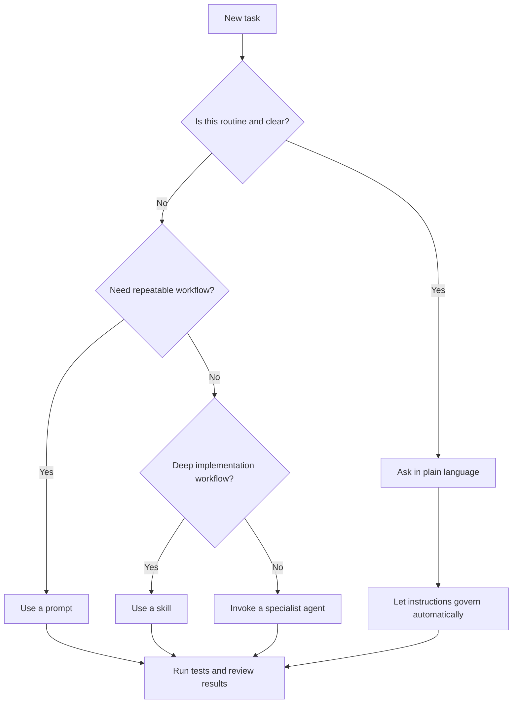

# Copilot Governance Beginner Quickstart

Audience: Engineers new to GitHub Copilot and generative AI working in this repository.

Purpose: Help you be productive quickly while staying inside project governance.

## If You Only Read One Minute

1. Describe the outcome you want in plain English.
2. Let instructions enforce rules automatically.
3. Use a prompt for repeatable workflows.
4. Escalate to a skill or agent only for complex or risky work.
5. Never ask Copilot to run git write commands.

## Mental Model In Plain English

Think of Copilot governance as a car:

- Instructions are the guardrails and traffic laws.
- Prompts are predefined routes.
- Skills are detailed driving playbooks.
- Agents are specialist copilots for hard roads.
- Hooks are safety checks before you keep driving.

## Start Here In 10 Minutes

1. Read [Copilot Governance Guide](CopilotGovernanceGuide.md).
2. Skim [Copilot Governance Index](../.github/README.md).
3. Understand the architecture flow in [Service Diagram](ServiceDiagram.md).
4. Keep this one rule in mind: ask for the outcome you want, then let governance files constrain how Copilot performs the work.
5. Verify two VS Code settings are enabled: `chat.includeApplyingInstructions: true` (required for scoped instruction files to apply automatically) and `github.copilot.chat.skillTool.enabled: true` (required for planning and troubleshooting skills to run in isolated subagents).

## How Governance Actually Works

You do not need to manually activate most governance artifacts.

1. Instructions are the baseline policy and load automatically by file scope.
   - Index: [Instructions Index](../.github/instructions/README.md)
   - Global defaults: [copilot-instructions](../.github/copilot-instructions.md)
2. Prompts are reusable workflows you invoke when you want a specific process.
   - Index: [Prompts Index](../.github/prompts/README.md)
3. Skills are deeper playbooks for specialized implementation tasks.
   - Index: [Skills Index](../.github/skills/README.md)
4. Agents are optional specialists for focused review or high-risk work.
   - Index: [Agents Index](../.github/agents/README.md)
5. Hooks are executable platform hooks (`.json` files that run shell commands at lifecycle events). Governance checklists are in `.github/checklists/` and are documents the model reads voluntarily.
   - Hooks: [Hooks README](../.github/hooks/README.md)
   - Checklists: [Checklists README](../.github/checklists/README.md)

## Day-One Operating Model

Use this order unless you have a reason not to:

1. Describe the task clearly in plain language.
2. Let instructions guide normal work.
3. Use a prompt when you want a repeatable workflow.
4. Use a skill for deeper domain-specific execution.
5. Invoke an agent when risk or ambiguity is high.

## 30-Second Decision Tree

## Prompt Vs Skill Vs Agent

Use a prompt when:
- The workflow is repeatable.
- You want consistency across engineers.
- You need a fast structured run.

Use a skill when:
- The task is implementation-heavy and multi-step.
- You want richer domain guidance than a prompt.

Use an agent when:
- The task is high-risk, cross-layer, or ambiguous.
- You want specialist judgment and explicit quality gates.
- You need role-specific review before completion.

## Agent Invocation Basics

In this repo, agent invocation is natural-language by name, not usually slash commands.

Example:
Use Test Engineer to assess test readiness for my changes in OrderFacade.

Primary user-invocable agents are listed in [Agents Index](../.github/agents/README.md).
Support agents are listed there too and are generally not invoked directly.

## Most Important Safety Rules

1. No git write operations by Copilot.
   - See [Git Safety Governance](../.github/instructions/git-safety-governance.instructions.md)
2. Preserve architecture boundaries.
   - See [Architecture Layering Governance](../.github/instructions/architecture-layering-governance.instructions.md)
3. Explicit mapping only, no AutoMapper.
   - See [Mapping Governance](../.github/instructions/mapping-governance.instructions.md)
4. Behavior changes require tests.
   - See [Unit Testing Governance](../.github/instructions/unit-testing-governance.instructions.md)
   - See [Integration Testing Governance](../.github/instructions/integration-testing-governance.instructions.md)
5. Planning and troubleshooting use approval gates.
   - Planning: [Planning Governance](../.github/instructions/planning-governance.instructions.md)
   - Troubleshooting: [Troubleshooting Workflow Governance](../.github/instructions/troubleshooting-workflow-governance.instructions.md)

## Practical Starter Prompts

For planning from requirements:
Use plan-from-requirements. Here are the requirements: <paste requirements>.

For adding an endpoint safely:
Use add-endpoint-architecture-safe to add GET /orders/{id}.

For test completeness review:
Use review-code-for-test-completeness on my latest facade and domain service changes.

For architecture review:
Use review-code-for-architecture-violations on the files I changed today.

## First Session Script (Copy And Paste)

Use this the first time you work on a task:

I am new to this repository and to Copilot governance. Please help me complete this task while following repository governance rules automatically.
Task: <describe desired outcome>
Constraints: keep architecture boundaries, explicit mapping only, and add tests for behavior changes.
Before coding, tell me whether this needs planning gate approval.

## Prompting Template For Better Results

Use this structure for most requests:

Outcome: <what should exist when done>
Scope: <files/components/layer>
Constraints: <performance, safety, architecture, mapping, tests>
Done means: <how to verify success>

Example:

Outcome: add endpoint to fetch order by id.
Scope: controller, facade, domain service, repository, tests.
Constraints: thin controller, no direct repository calls from controller, explicit mapping only.
Done means: endpoint returns expected status codes and tests pass.

## Common Beginner Mistakes

1. Asking Copilot to jump directly to implementation when planning gates apply.
2. Assuming an agent is always required.
3. Treating prompts and skills as equivalent.
4. Requesting git commit or push operations from Copilot.
5. Forgetting to ask for tests with behavior changes.

## Quick FAQ

Do I need to invoke agents for normal work?
- No. Instructions are usually enough for routine tasks.

Are slash commands required to invoke agents?
- Usually no. Use natural-language invocation with the agent name.

Will governance apply if I do nothing special?
- Yes. Instructions are the default, always-on policy layer.

How do I know when to ask for an agent?
- Ask when the task is cross-layer, high-risk, or unclear.
- Otherwise start with plain request or prompt.

What if Copilot tries to skip tests?
- Ask explicitly: Add or update unit and integration tests for changed behavior.

## Simple Glossary

- Governance: Rules that keep AI-generated changes safe and consistent.
- Instruction: Auto-loaded policy file based on file scope.
- Prompt: Reusable workflow you invoke intentionally.
- Skill: Deep task playbook with more procedural guidance.
- Agent: Specialist role for focused review or complex execution.
- Hook: Safety check that blocks or warns at critical gates.

## Suggested Team Rollout

1. Week 1: Use only instructions plus 2 to 3 core prompts from [Prompts Index](../.github/prompts/README.md).
2. Week 2: Add skill-based workflows for common implementation tasks from [Skills Index](../.github/skills/README.md).
3. Week 3: Introduce agent escalation for high-risk changes from [Agents Index](../.github/agents/README.md).
4. Week 4: Review pain points and tune prompt and skill usage using [Governance Activation Profile](../.github/governance-activation-profile.md).

## Reference Map

- Full governance walkthrough: [Copilot Governance Guide](CopilotGovernanceGuide.md)
- One-page beginner checklist: [Copilot Governance One Page](CopilotGovernanceOnePage.md)
- Activation strategy: [Governance Activation Profile](../.github/governance-activation-profile.md)
- Repository defaults: [copilot-instructions](../.github/copilot-instructions.md)
- Requirements source for this governance set: [Governance Requirements](requirements-copilot-governance-dotnet10-coeus-20260428.md)
