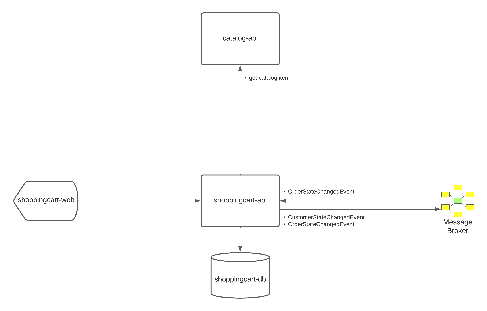

# ShoppingCart Service Diagram

## Service relationship/responsibility breakdown

The shopping cart service is responsible for the management of creating orders for fulfillment.

### shoppingcart-api
* Create customers
* Create order for a customer
* Publish AMQP message for customer state changes
* Publish AMQP message for order state changes

### catalog-api

* get unit price from catalog by sku
